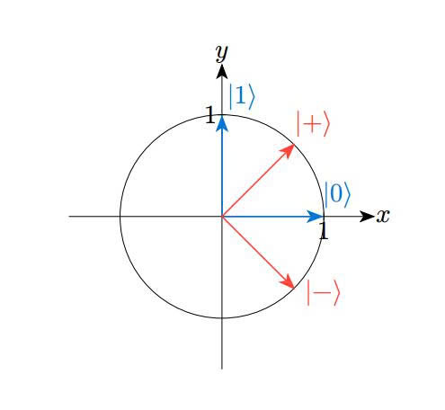
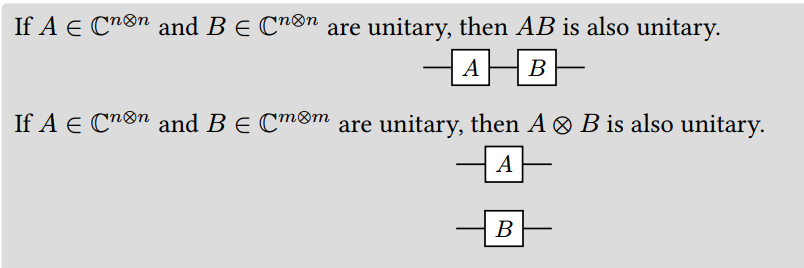
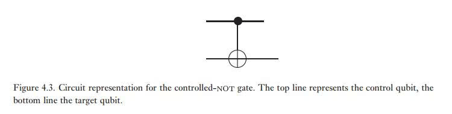
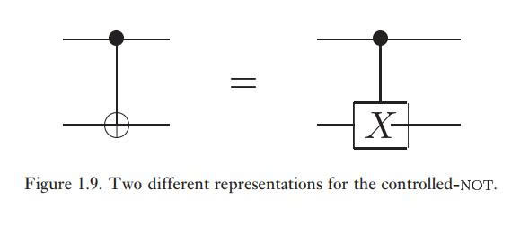
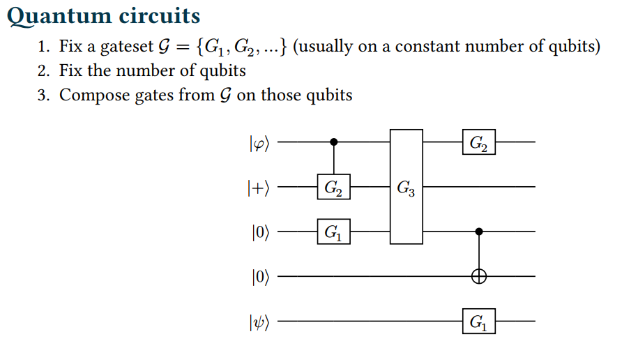
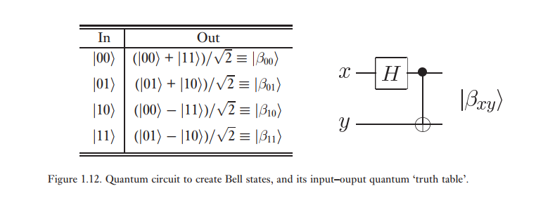
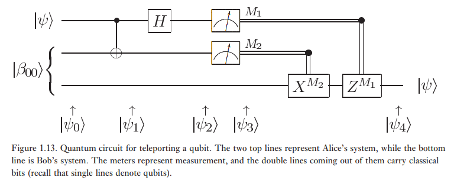

# Introduction to Quantum Cryptography
## 1. Quantum bits
### 1.1. Quantum bits:
- *Hilbert space*: is a vector space (typically defined over the complex numbers), equipped with an inner product. This implies that quantum states are represented as vectors.  
- The elementary Hilbert space used in quantum information is the qubit space, which is a complex Hilbert space of dimension 2. Suppose $|0\rangle$ and $|1\rangle$ form an orthonormal basis for that state space. Then an arbitrary state vector in the state space can be written:
  $$|\psi\rangle = \begin{pmatrix} \mathbf{\alpha} \\ \mathbf{\beta} \end{pmatrix} = \mathbf{\alpha}|0\rangle + \mathbf{\beta}|1\rangle$$
with:  $\alpha$ and $\beta$ are complex numbers ($|\alpha|^2 + |\beta|^2 = 1$)
$$|0\rangle = \begin{pmatrix} 1 \\ 0 \end{pmatrix}, |1\rangle = \begin{pmatrix} 0 \\ 1 \end{pmatrix} $$
- The states $|0\rangle$ and $|1\rangle$ are analogous to the two values 0 and 1 which a bit may take. The way a qubit differs from a bit is that superpositions of these two states, of the form $ \alpha |0\rangle + \beta |1\rangle$, can also exist, in which it is not possible to say that the qubit is definitely in the state $|0\rangle$, or definitely in the state $|1\rangle$.

- A qubit’s state is a unit vector in a two-dimensional complex vector space and is normalized to length 1. 
    

- Hadamard basis
$$|+\rangle = \begin{pmatrix} \frac{1}{\sqrt{2}} \\ \frac{1}{\sqrt{2}} \end{pmatrix} = \frac{1}{\sqrt{2}}(|0\rangle + |1\rangle)$$
$$|-\rangle = \begin{pmatrix} \frac{1}{\sqrt{2}} \\ -\frac{1}{\sqrt{2}} \end{pmatrix} = \frac{1}{\sqrt{2}}(|0\rangle - |1\rangle)$$
- Measuring a qubit we get either the result 0, with probability $|\alpha|^2$, or the result 1, with probability $|\beta|^2$. (Quantum Measurement)
### 1.2 Multiple qubits:

#### 1.2.1. Dirac notation:
- Ket: column vector
$$|\psi\rangle = \begin{pmatrix} a_1 \\ a_2 \\ \dots \\ a_m \end{pmatrix} \qquad |\varphi\rangle = \begin{pmatrix} b_1 \\ b_2 \\ \dots \\ b_m \end{pmatrix}$$
- Bra: row vector
$$\langle\psi| = (a_1^* \quad a_2^* \quad \dots \quad a_m^*)$$
$$\langle\varphi| = (b_1^* \quad b_2^* \quad \dots \quad b_m^*)$$
- Bra-ket: inner product (complex number)
$$\langle\varphi|\psi\rangle = (b_1^* \quad b_2^* \quad \dots \quad b_m^*) \begin{pmatrix} a_1 \\ a_2 \\ \dots \\ a_m \end{pmatrix}$$

$$= \sum_{i \in [m]} b_i^* a_i \in \mathbb{C}$$
- Ket-bra: outer product (complex matrix)
$$|\varphi\rangle\langle\psi| = \begin{pmatrix} b_1 \\ b_2 \\ \dots \\ b_m \end{pmatrix} (a_1^* \quad a_2^* \quad \dots \quad a_m^*)$$

$$= \begin{pmatrix} 
b_1 a_1^* & b_1 a_2^* & \dots & b_1 a_m^* \\ 
b_2 a_1^* & b_2 a_2^* & \dots & b_2 a_m^* \\ 
\dots & \dots & \dots & \dots \\ 
b_m a_1^* & b_m a_2^* & \dots & b_m a_m^* 
\end{pmatrix} \in \mathbb{C}^{m \times m}$$
- Tensor product:
  - Kronecker product:
  $$A \otimes B \equiv \left. \overbrace{\begin{bmatrix} A_{11}B & A_{12}B & \dots & A_{1n}B \\ A_{21}B & A_{22}B & \dots & A_{2n}B \\ \vdots & \vdots & \vdots & \vdots \\ A_{m1}B & A_{m2}B & \dots & A_{mn}B \end{bmatrix}}^{nq} \right\} mp$$
##### 1.2.2. Mutiple qubits:
- **Postulate:** The state space of a composite physical system is the tensor product of the state spaces of the component physical systems. 
  - With n qubits:
$$\mathcal{H}_{\text{n-qubits}} = \mathcal{H}_1 \otimes \mathcal{H}_2 \otimes \dots \otimes \mathcal{H}_n$$

$$\Rightarrow\text{Dim}(\mathcal{H}_{\text{n-qubits}}) = \text{Dim}(\mathcal{H}_1 \times \mathcal{H}_2 \times..... \times \mathcal{H}_n) $$

$$\Rightarrow \text{Dim}(\mathcal{H}_{\text{n-qubits}}) = \text{Dim}(\mathcal{H}_1) \times \text{Dim}(\mathcal{H}_2) \times \dots \times \text{Dim}(\mathcal{H}_n)$$

$$\Rightarrow \text{Dim}(\mathcal{H}_{\text{n-qubits}})= \text{Dim}(\mathbb{C}^2 ) \times \text{Dim}(\mathbb{C}^2 ) \times \dots \times \text{Dim}(\mathbb{C}^2 )$$

$$ = \underbrace{2 \times 2 \times \dots \times 2}_{n \text{ lần}} = 2^n$$

## 2. Evolution of Quantum States

### 2.1. Theoretical Foundation

* **Schrödinger Equation:** The continuous time evolution of a closed quantum system is governed by:

  $$i\hbar \frac{\partial}{\partial t} |\psi\rangle = \hat{H}|\psi\rangle$$

* **Unitary Operator:** In quantum information, state evolution is represented discretely by a unitary operator $U$ (quantum gate):

* **Unitary Condition:**   $U U^\dagger = U^\dagger U = I \quad \implies \quad U^\dagger = U^{-1}$

### 2.2. Quantum Unitaries:

#### 1. Pauli-X Gate (Bit-Flip)
- The $X$ gate acts as the quantum NOT operation in the computational basis, flipping $|0\rangle \leftrightarrow |1\rangle$:
* Action on Basis States:
$$X = \begin{pmatrix} 0 & 1 \\ 1 & 0 \end{pmatrix}$$

  $$X|0\rangle = \begin{pmatrix} 0 & 1 \\ 1 & 0 \end{pmatrix}\begin{pmatrix} 1 \\ 0 \end{pmatrix} = \begin{pmatrix} 0 \\ 1 \end{pmatrix} = |1\rangle \quad \text{and} \quad X|1\rangle = |0\rangle$$

#### 2. Pauli-Z Gate (Phase-Flip)
- 𝑍 is the NOT operation in the Hadamard basis: 
  - The $Z$ gate leaves $|0\rangle$ unchanged and flips the phase of $|1\rangle$:

$$Z = \begin{pmatrix} 1 & 0 \\ 0 & -1 \end{pmatrix}$$

* Action on Basis States:
  $$Z|0\rangle = |0\rangle \quad \text{and} \quad Z|1\rangle = -|1\rangle$$

* Eigenvectors: $\{|0\rangle, |1\rangle\}$ are the eigenvectors of $Z$ corresponding to eigenvalues $+1$ and $-1$, respectively, so the computational basis is also referred to as the **$Z$-basis**.

#### 3. Hadamard Gate $H$ (Basis Switch)
* The $H$ gate transforms states between the computational basis ($Z$-basis) and the Hadamard basis ($X$-basis) in both directions:

$$H = \frac{1}{\sqrt{2}}\begin{pmatrix} 1 & 1 \\ 1 & -1 \end{pmatrix}$$

* Moving from $Z$-basis to $X$-basis:
  $$H|0\rangle = |+\rangle \quad \text{and} \quad H|1\rangle = |-\rangle$$

* Moving from $X$-basis back to $Z$-basis:
  $$H|+\rangle = |0\rangle \quad \text{and} \quad H|-\rangle = |1\rangle$$
## 3. Quantum circuit:
### 3.1. Composing Unitaries:
- The circuit is to be read from left-to-right. Each line in the circuit represents a wire in the quantum circuit.
- Multi-Qubit Operator Representation in Quantum Circuits:
  - Unitary operators $U$ act on the state vector $|\Psi\rangle$ from **right to left** via operator composition:

  $$|\Psi_{\text{out}}\rangle = U_3 \cdot U_2 \cdot U_1 |\Psi_{\text{in}}\rangle$$

     *(Note: The gate layer executed earliest on the far left appears adjacent to the initial state vector).*
  - If a wire does not contain a gate at a given time step, it corresponds to the *Identity operator $I$*—leaving the state of that qubit unchanged.
    - *To be more specific*:  If a single-qubit gate $A$ acts on the first qubit while the second qubit remains unacted upon, the global operator acting on the composite system is given by $A \otimes I$, where $I$ represents the identity operator on the second qubit.
  - When multiple gates act in parallel on distinct wires (qubits) at the same time step, the overall global operator is given by the tensor product of the individual gates.
    - *To be more specific*: When two single-qubit gates $A$ and $B$ are applied concurrently across separate wires, they operate independently and simultaneously. Then the overall unitary transformation of the joint state space is defined by the tensor product $A \otimes B$.
  
    
 
  
- The controlled-NOT gate: 
  - The operational principle of the CNOT gate is: *if Qubit 1 is in state $|1\rangle$, flip Qubit 2; if Qubit 1 is in state $|0\rangle$, leave Qubit 2 unchanged.*
  
  
  
### 3.2. Application in Circuit Reading Comprehension:

- Initial state: 
  $$|\Psi_{\text{in}}\rangle = |\varphi\rangle \otimes |+\rangle \otimes |0\rangle \otimes |0\rangle \otimes |\psi\rangle \equiv |\varphi\rangle |+\rangle |00\rangle |\psi\rangle$$
- Time step 1:

  * **Wires 1 & 2:** Controlled-$G_2$ gate with Wire 1 acting as the control qubit $\rightarrow$ Operator notation: $c(G_2)$.
  * **Wire 3:** Single-qubit gate $G_1$.
  * **Wires 4 & 5:** Idle wires (Identity) $\rightarrow$ 2-qubit Identity operator: $I_4 \otimes I_5 \equiv I_{45}$.

  $$\Rightarrow U_1 = c(G_2) \otimes G_1 \otimes I_{45}$$
- Time step 2:
  * **Wires 1, 2 & 3:** 3-qubit gate $G_3$ acting simultaneously on the first three qubits.
  * **Wires 4 & 5:** Idle wires $\rightarrow I_{45}$.

  $$\Rightarrow U_2 = G_3 \otimes I_{45}$$

- Time step 3:
  * **Wire 1:** Single-qubit gate $G_2$.
  * **Wire 2:** Idle wire $\rightarrow$ Identity operator $I$.
  * **Wires 3 & 4:** CNOT gate ($c(X)$) with Wire 3 as control and Wire 4 as target.
  * **Wire 5:** Single-qubit gate $G_1$.

  $$\Rightarrow U_3 = G_2 \otimes I \otimes c(X) \otimes G_1$$
$$\Rightarrow U = (G_2 \otimes I \otimes c(X) \otimes G_1)(G_3 \otimes I_{45})(c(G_2) \otimes G_1 \otimes I_{45})|\varphi\rangle|+\rangle|00\rangle|\psi\rangle$$
## 4. Quantum measurement:

*  **Probabilistic Nature of quantum mechanics:** Unlike classical physics, quantum mechanics cannot predict the exact outcome of a measurement. Instead, it determines the exact probability distribution of all possible outcomes.
 ### 4.1. Measure $\hat{A}$ in state $|\psi\rangle$ (No Degeneracy):

* **Eigenvalues and eigenvectors:** 

  $$\text{Physical quantity } A \longrightarrow \text{Observable } \hat{A}$$

  $$\hat{A} |u_n\rangle = \lambda_n |u_n\rangle$$

* ***Postulate III:*** The result of a measurement of a physical quantity is one of the eigenvalues of the associated observable.
* ***Postulate IV:*** The measurement of $\mathcal{A}$ in a system in normalized state $|\psi\rangle$ gives eigenvalue $\lambda_n$ with probability:

  $$P(\lambda_n) = |\langle u_n | \psi \rangle|^2$$

* **Having a quantum state prepared in a superposition:**

  $$|\psi\rangle = c_1|u_1\rangle + c_2|u_2\rangle + \dots + c_n|u_n\rangle = \sum_{i} c_i|u_i\rangle \quad \text{where } c_i = \langle u_i | \psi \rangle$$

  **Constructing a projection operator $P_n$** to project the arbitrary state $|\psi\rangle$ onto the specific subspace spanned by the eigenstate $|u_n\rangle$, annihilating all orthogonal components and isolating only the $n$-th component:

  $$P_n |\psi\rangle = c_n |u_n\rangle$$

  where $P_n = |u_n\rangle\langle u_n|$ is the projection operator associated with the eigenstate $|u_n\rangle$.

* Therefore, the measurement probability $P(\lambda_n)$ can be expressed directly as:

  $$P(\lambda_n) = |\langle u_n | \psi \rangle|^2 = |c_n|^2$$

### 4.2. Measure $\hat{A}$ in state $|\psi\rangle$ (With Degeneracy):

* **Degenerate eigenvalues:**

  $$\hat{A} |u_n^i\rangle = \lambda_n |u_n^i\rangle \quad \text{for } i = 1, 2, \dots, g_n$$

* **Degenerate Case:** The measurement of $\mathcal{A}$ in a system in normalized state $|\psi\rangle$ gives eigenvalue $\lambda_n$ (with degeneracy $g_n$) with probability:

  $$P(\lambda_n) = \sum_{i=1}^{g_n} |\langle u_n^i | \psi \rangle|^2$$

* **Having a quantum state prepared in a superposition:**

  $$|\psi\rangle = \sum_n \sum_{i=1}^{g_n} c_n^i |u_n^i\rangle \quad \text{where } c_n^i = \langle u_n^i | \psi \rangle$$

  **Constructing a projection operator $P_n$** to project the arbitrary state $|\psi\rangle$ onto the specific $g_n$-dimensional subspace spanned by the degenerate eigenstates $\{|u_n^i\rangle\}$, annihilating all orthogonal components and isolating only the $n$-th degenerate component:

  $$P_n |\psi\rangle = \sum_{i=1}^{g_n} c_n^i |u_n^i\rangle$$

  where $P_n = \sum_{i=1}^{g_n} |u_n^i\rangle\langle u_n^i|$ is the projection operator associated with the degenerate eigenvalue $\lambda_n$.

* Therefore, the measurement probability $P(\lambda_n)$ can be expressed directly as:

  $$P(\lambda_n) = \langle\psi| P_n |\psi\rangle = \sum_{i=1}^{g_n} |\langle u_n^i | \psi \rangle|^2 = \sum_{i=1}^{g_n} |c_n^i|^2$$

### 4.3. Partial Measurement on Composite Systems:

- In multi-qubit systems, a **partial measurement** involves performing a projective measurement on a specific subset of qubits (e.g., measuring one qubit out of an $n$-qubit system) while leaving the remaining subsystem unmeasured.
#### 4.3.1. Formulation:
* Consider an $n$-qubit state expressed in the computational basis:

$$|\psi\rangle = \sum_{i \in \{0,1\}^n} \alpha_i |i\rangle = \sum_{b \in \{0,1\}} \sum_{j \in \{0,1\}^{n-1}} \alpha_{bj} |b\rangle \otimes |j\rangle$$

* When measuring only the **first qubit** in the computational basis:
  * **Outcome Probability $p_b$:** The probability of obtaining bit $b$ is the sum of the squared magnitudes of the amplitudes associated with all basis states starting with $b$:

  $$p_b = \sum_{j \in \{0,1\}^{n-1}} |\alpha_{bj}|^2$$

  * **State Collapse:** Upon obtaining outcome $b$, the first qubit collapses into the classical basis state $|b\rangle$, while the remaining $(n-1)$ qubits retain their coherent superposition, normalized by $\frac{1}{\sqrt{p_b}}$:

  $$|\psi'\rangle = \frac{1}{\sqrt{p_b}} \sum_{j \in \{0,1\}^{n-1}} \alpha_{bj} |bj\rangle$$

#### 4.3.2. Worked Example:
Consider a 2-qubit state $|\psi\rangle = \frac{1}{\sqrt{3}}(|00\rangle + |01\rangle + |10\rangle)$. Measuring the first qubit in the computational basis yields two possible outcomes:

* **Outcome $b = 0$:**
  * **Probability:** $p_0 = \left|\frac{1}{\sqrt{3}}\right|^2 + \left|\frac{1}{\sqrt{3}}\right|^2 = \frac{2}{3}$
  * **Post-Measurement State:** 
    $$|\psi'\rangle = \frac{1}{\sqrt{2/3}} \left( \frac{1}{\sqrt{3}}|00\rangle + \frac{1}{\sqrt{3}}|01\rangle \right) = \frac{1}{\sqrt{2}}(|00\rangle + |01\rangle)$$

* **Outcome $b = 1$:**
  * **Probability:** $p_1 = \left|\frac{1}{\sqrt{3}}\right|^2 = \frac{1}{3}$
  * **Post-Measurement State:** 
    $$|\psi'\rangle = \frac{1}{\sqrt{1/3}} \left( \frac{1}{\sqrt{3}}|10\rangle \right) = |10\rangle$$
### 4.4. Projective Measurements on Pure States:
- A projective measurement is defined by a set of Hermitian projection operators $\{\Pi_1, \Pi_2, \dots, \Pi_k\}$ satisfying the completeness relation:

$$\sum_{i=1}^k \Pi_i = I$$

- When measuring a pure quantum state $|\psi\rangle$:

  * **Outcome Probability:** The probability of obtaining outcome $i$  is given by Born's rule:

  $$P(i) = \|\Pi_i |\psi\rangle\|^2 = \langle\psi| \Pi_i |\psi\rangle$$

  * **State Collapse:** Upon detecting outcome $i$, the quantum state collapses into the normalized post-measurement state:

  $$|\psi'\rangle = \frac{\Pi_i |\psi\rangle}{\|\Pi_i |\psi\rangle\|}$$

## 5. Quantum Entanglement:
- **Product states:** A bipartite state $|\psi\rangle_{AB}$ is said to be a product state if there exists $|\psi_1\rangle_A$ and $|\psi_2\rangle_B$ such that

$$|\psi\rangle_{AB} = |\psi_1\rangle_A \otimes |\psi_2\rangle_B$$
- If a quantum state is not a product state, it is **entangled**.

 $$W_n = \frac{1}{\sqrt{n}}(|10\dots0\rangle + |01\dots0\rangle + \dots + |00\dots1\rangle)$$
### 5.1. Bell State:
- Bell states are typically generated via a *quantum circuit* consisting of two fundamental gates: the *Hadamard gate ($H$)* and the *Controlled-NOT gate (CNOT)*. 
  - The Hadamard transform puts the top qubit in a superposition, this then acts as a control input to the *CNOT*, and the target gets inverted only when the
control is 1. 
  - As an explicit example, the Hadamard gate takes the input $|00\rangle$ to $(|0\rangle + |1\rangle)|0\rangle / \sqrt{2}$. Then pass the composite system through a CNOT gate, where Qubit 1 acts as the *Control qubit* and Qubit 2 acts as the *Target qubit*, and then the CNOT gives the output state  $(|00\rangle + |11\rangle) / \sqrt{2}$

- Bell basic:
  $$\left\{ \underbrace{\frac{1}{\sqrt{2}}(|00\rangle + |11\rangle)}_{|\Psi_{00}\rangle \text{/EPR pair}}, \underbrace{\frac{1}{\sqrt{2}}(|00\rangle - |11\rangle)}_{|\Psi_{01}\rangle}, \underbrace{\frac{1}{\sqrt{2}}(|01\rangle + |10\rangle)}_{|\Psi_{10}\rangle}, \underbrace{\frac{1}{\sqrt{2}}(|01\rangle - |10\rangle)}_{|\Psi_{11}\rangle} \right\}$$
- Spooky action at a distance:
  * A and B share an EPR pair, and move very, very far apart
  *  If A measures in some basis and has outcome 𝑏, and Bob measures in the same basis he
also gets bit 𝑏.
### 5.2. Quantum teleportation:
- Alice and Bob share a pair of entangled qubits (an **EPR pair**), after which they separate and are located spatially distant from each other. Alice's task is to transmit an unknown qubit state $|\psi\rangle = \alpha|0\rangle + \beta|1\rangle$ to Bob, but she can only transmit **classical information** (ordinary classical bits 0 and 1).
- **Quantum teleportation** resolves this dilemma by utilizing the shared entangled EPR pair as a resource, combined with a minimal amount of classical communication.
  
$$|\psi_0\rangle = |\psi\rangle|\beta_{00}\rangle$$

$$= \frac{1}{\sqrt{2}} \left[ \alpha|0\rangle(|00\rangle + |11\rangle) + \beta|1\rangle(|00\rangle + |11\rangle) \right]$$

  where we use the convention that the first two qubits (on the left) belong to Alice, and the third qubit to Bob. As we explained previously, Alice’s second qubit and Bob’s qubit start out in an EPR state. Alice sends her qubits through a CNOT gate, obtaining

$$|\psi_1\rangle = \frac{1}{\sqrt{2}} \left[ \alpha|0\rangle(|00\rangle + |11\rangle) + \beta|1\rangle(|10\rangle + |01\rangle) \right]. $$

- She then sends the first qubit through a Hadamard gate, obtaining

$$|\psi_2\rangle = \frac{1}{2} \left[ \alpha(|0\rangle + |1\rangle)(|00\rangle + |11\rangle) + \beta(|0\rangle - |1\rangle)(|10\rangle + |01\rangle) \right]. $$

This state may be re-written in the following way, simply by regrouping terms:

$$\begin{aligned}
|\psi_2\rangle = \frac{1}{2} \Big[ &|00\rangle (\alpha|0\rangle + \beta|1\rangle) + |01\rangle (\alpha|1\rangle + \beta|0\rangle) \\
&+ |10\rangle (\alpha|0\rangle - \beta|1\rangle) + |11\rangle (\alpha|1\rangle - \beta|0\rangle) \Big].
\end{aligned} $$
- *Alice performs measurement:* The projective measurement collapses the composite quantum state into one of four classical outcomes with equal probability of $25\%$ ($P = 1/4$): *00, 01, 10, or 11*.
- Depending on Alice’s measurement outcome, Bob’s qubit will end up in one of these four possible states. Of course, to know which state it is in, Bob must be told the result of Alice’s measurement.

| Alice's Measurement Outcome | Bob's Initial State ($\vert{}\psi_3\rangle$) | Applied Pauli Operator | Bob's Final State |
| :---: | :---: | :---: | :---: |
| **`00`** | $\alpha\vert{}0\rangle + \beta\vert{}1\rangle$ | $I$ (Identity operator) | $\alpha\vert{}0\rangle + \beta\vert{}1\rangle = \vert{}\psi\rangle$ |
| **`01`** | $\alpha\vert{}1\rangle + \beta\vert{}0\rangle$ | $X$ (Bit-flip gate) | $X(\alpha\vert{}1\rangle + \beta\vert{}0\rangle) = \alpha\vert{}0\rangle + \beta\vert{}1\rangle = \vert{}\psi\rangle$ |
| **`10`** | $\alpha\vert{}0\rangle - \beta\vert{}1\rangle$ | $Z$ (Phase-flip gate) | $Z(\alpha\vert{}0\rangle - \beta\vert{}1\rangle) = \alpha\vert{}0\rangle + \beta\vert{}1\rangle = \vert{}\psi\rangle$ |
| **`11`** | $\alpha\vert{}1\rangle - \beta\vert{}0\rangle$ | $ZX = XZ$ (Bit- & Phase-flip) | $ZX(\alpha\vert{}1\rangle - \beta\vert{}0\rangle) = \alpha\vert{}0\rangle + \beta\vert{}1\rangle = \vert{}\psi\rangle$ |

### 5.3. Application: Superdense Coding

* Superdense coding involves two parties, conventionally known as 'Alice' and 'Bob', who are a long way away from one another. Their goal is to transmit some classical information from Alice to Bob. Suppose Alice is in possession of two classical bits of information which she wishes to send Bob, but is only allowed to send a single qubit to Bob.

* By sending the single qubit in her possession to Bob, it turns out that Alice can communicate two bits of classical information to Bob.
  
  * Initial state:

    $$\vert{}\psi\rangle = \frac{\vert{}00\rangle + \vert{}11\rangle}{\sqrt{2}}$$

  * To send *00* (applying the identity gate $I$):

    $$I\vert{}\psi\rangle = \frac{\vert{}00\rangle + \vert{}11\rangle}{\sqrt{2}}$$

  * To send *01* (applying the phase flip gate $Z$):

    $$Z\vert{}\psi\rangle = \frac{\vert{}00\rangle - \vert{}11\rangle}{\sqrt{2}}$$

  * To send *10* (applying the quantum NOT gate $X$):

    $$X\vert{}\psi\rangle = \frac{\vert{}10\rangle + \vert{}01\rangle}{\sqrt{2}}$$

  * To send *11* (applying the $iY$ gate):

    $$iY\vert{}\psi\rangle = \frac{\vert{}01\rangle - \vert{}10\rangle}{\sqrt{2}}$$

* Notice that the Bell states form an orthonormal basis, and can therefore be distinguished by an appropriate quantum measurement. If Alice sends her qubit to Bob, giving Bob possession of both qubits, then by doing a measurement in the Bell basis Bob can determine which of the four possible bit strings Alice sent.
## 6.  Quantum Mixed States:
### 6.1. Pure States and *Statistical Mixture of States::
#### 6.1.1 Pure States (Superposition State):
- The system is completely described by a single state vector as a linear combination of eigenstates:
    $$|\psi\rangle = \sum_{i=1}^{n} c_i |u_i\rangle = c_1 |u_1\rangle + c_2 |u_2\rangle + \dots + c_n |u_n\rangle$$
    with normalization condition $\sum_{i=1}^{n} |c_i|^2 = 1$.
- Measurement:
  - Eigenvalue equations:
$$\hat{B}|v_m\rangle = \mu_m |v_m\rangle$$
 $$
\begin{align*}
P(\mu_m) &= |\langle v_m | \psi \rangle|^2 \\
&= \left| \sum_{i=1}^{n} c_i \langle v_m | u_i \rangle \right|^2 \\
&= \left( \sum_{i=1}^{n} c_i \langle v_m | u_i \rangle \right)^* \left( \sum_{j=1}^{n} c_j \langle v_m | u_j \rangle \right) \\
&= \left( \sum_{i=1}^{n} c_i^* \langle v_m | u_i \rangle^* \right) \left( \sum_{j=1}^{n} c_j \langle v_m | u_j \rangle \right) \\
&= \sum_{i=1}^{n} |c_i|^2 |\langle v_m | u_i \rangle|^2 + 2 \sum_{1 \le i < j \le n} \operatorname{Re} \left\{ c_i c_j^* \langle v_m | u_i \rangle \langle v_m | u_j \rangle^* \right\}
\end{align*}
$$
  - **Note:** The second term is the **quantum interference term**

#### 6.1.2. Statistical Mixture of States:

  * Represents an *Ensemble* consisting of multiple distinct systems.
  *  In the population of $N = \sum_{i=1}^{n} n_i$ particles, there are $n_i$ particles definitely in state $|u_i\rangle$. The classical probabilities $p_i$ are set to match the squared modulus of the quantum amplitudes:
  $$p_i = \frac{n_i}{N} = \frac{n_i}{\sum_{k=1}^{n} n_k} = |c_i|^2$$
- Measurement:
  - Eigenvalue equations:
$$\hat{B}|v_m\rangle = \mu_m |v_m\rangle$$
 
  $$P(|u_i\rangle) = |c_i|^2 \quad \text{for } i = 1, 2, \dots, n$$
  $$P_{u_i}(\mu_m) = |\langle v_m | u_i \rangle|^2 \quad \text{for } i = 1, 2, \dots, n$$
  $$\Rightarrow P(\mu_m) = \sum_{i=1}^{n} P(|u_i\rangle) P_{u_i}(\mu_m) = \sum_{i=1}^{n} |c_i|^2 |\langle v_m | u_i \rangle|^2
$$
**Note:** Mixed states lack the quantum interference term because there is no phase coherence between distinct ensemble components.
### 6.2. Mixed States:
- Unlike a pure state—where a quantum system is completely known and described by a single state vector $\vert{}\psi\rangle$—a mixed state arises when we possess only incomplete information about the system's true condition.
- A mixed state represents an ensemble comprising a statistical mixture of various pure states. Consequently, it is jointly governed by two key components:
  - **Constituent pure states ($|\psi_i\rangle$):** The underlying quantum states belonging to the ensemble.

  - **Probabilities of each pure state in the mixed state ($p_i$):** Quantifying the probability of each pure state within the statistical mixture, subject to the normalization condition $\sum_i p_i = 1$.

### 6.3. Density Operator
- The density operator language provides a convenient means for describing quantum systems whose state is not completely known.
#### 6.3.1. Density Operator for Pure Quantum States
##### 1. Matrix Representation of Pure States

- Given an orthonormal basis $\{|u_i\rangle\}$ satisfying $\langle u_i | u_j \rangle = \delta_{ij}$:

  * **State Vector:**
    $$|\psi\rangle = \sum_i c_i |u_i\rangle$$

  * **Density Operator (Projection Operator for a Pure State):**
    $$\hat{\rho} = |\psi\rangle\langle\psi|$$

  * **Matrix Elements:**
    $$\rho_{ij} = \langle u_i | \hat{\rho} | u_j \rangle = \langle u_i | \psi \rangle \langle \psi | u_j \rangle = c_i c_j^*$$

  * **Representations:**
    $$|\psi\rangle \longrightarrow \begin{pmatrix} c_1 \\ c_2 \\ c_3 \\ \vdots \end{pmatrix}, \quad \hat{\rho} \longrightarrow \begin{pmatrix} c_1 c_1^* & c_1 c_2^* & \dots \\ c_2 c_1^* & c_2 c_2^* & \dots \\ \vdots & \vdots & \ddots \end{pmatrix}$$

##### 2. Normalization Condition:

* **State Vector Normalization:** $\langle\psi|\psi\rangle = 1$
  $$\langle\psi|\psi\rangle = \left(\sum_i c_i^* \langle u_i|\right)\left(\sum_j c_j |u_j\rangle\right) = \sum_{i,j} c_i^* c_j \langle u_i|u_j\rangle = \sum_{i,j} c_i^* c_j \delta_{ij} = \sum_i |c_i|^2$$

* **Density Operator Normalization (Unit Trace Condition):**
  $$\rho_{ii} = |c_i|^2$$
  $$1 = \sum_i |c_i|^2 = \sum_i \rho_{ii} = \operatorname{Tr}(\hat{\rho})$$

  $$\langle\psi|\psi\rangle = 1 \iff \operatorname{Tr}(\hat{\rho}) = 1$$

#### 6.3.2. Density Operator for Mixed Quantum States

##### **1. Definition and Ensemble Representation**

- A **mixed state** represents a statistical ensemble of pure states $\{ (p_k, |\psi_k\rangle) \}$, where $p_k$ is the classical probability of finding the system in the pure state $|\psi_k\rangle$.

- **Density Operator :**
  $$\hat{\rho} = \sum_k p_k |\psi_k\rangle\langle\psi_k|$$
  where $p_k \ge 0$ and $\sum_k p_k = 1$.

- In an orthonormal basis $\{|u_i\rangle\}$, the matrix elements of the density operator for a mixed state are:
  $$\rho_{ij} = \langle u_i | \hat{\rho} | u_j \rangle = \sum_k p_k \langle u_i | \psi_k \rangle \langle \psi_k | u_j \rangle$$

##### 2. Normalization Condition:
- **Pure state:** $\operatorname{Tr}(\hat{\rho}_k) = 1$

$$
\begin{align*}
\operatorname{Tr}(\hat{\rho}) &= \operatorname{Tr}\left( \sum_k p_k \hat{\rho}_k \right) \\
&= \sum_k p_k \underbrace{\operatorname{Tr}(\hat{\rho}_k)}_{= 1} \\
&= \sum_k p_k = 1
\end{align*}
$$
### 6.4. Partial Trace and Reduced Density Operator:
- Consider a bipartite quantum state $\rho_{AB}$ defined on the tensor product Hilbert space $\mathcal{H}_A \otimes \mathcal{H}_B$. Let $\{|i\rangle\}$ and $\{|k\rangle\}$ be orthonormal bases for $\mathcal{H}_A$ and $\mathcal{H}_B$, respectively. The general density operator $\rho_{AB}$ can be expanded as:

$$\rho_{AB} = \sum_{i,j,k,l} \rho_{ijkl} \left( |i\rangle\langle j| \otimes |k\rangle\langle l| \right)$$
- The **partial trace** over subsystem $B$, denoted as $\operatorname{tr}_B$, yields the **reduced density operator** $\rho_A$ of subsystem $A$:

$$
\begin{align*}
\rho_A = \operatorname{tr}_B(\rho_{AB}) &= \operatorname{tr}_B \left( \sum_{i,j,k,l} \rho_{ijkl} |i\rangle\langle j| \otimes |k\rangle\langle l| \right) \\
&= \sum_{i,j,k,l} \rho_{ijkl} |i\rangle\langle j| \operatorname{tr}\left(|k\rangle\langle l|\right) \\
&= \sum_{i,j,k,l} \rho_{ijkl} |i\rangle\langle j| \langle l | k \rangle \\
&= \sum_{i,j,k} \rho_{ijkk} |i\rangle\langle j|
\end{align*}
$$

#### Remark:
* $\operatorname{tr}(\rho_A) = 1$.
* $\rho_A$ contains all information accessible by measurements performed only on $A$.
* Information about correlations with $B$ is generally lost.
#### Note: 
-  The reduced density operator transforms an entangled state into a mixed state.
  $$
\begin{align*}
\hat{\rho} &= \sum_k p_k |\psi_k\rangle\langle\psi_k| \\
&= \sum_k p_k \left( \sum_i c_i^{(k)} |i\rangle \right) \left( \sum_j (c_j^{(k)})^* \langle j| \right) \\
&= \sum_{i,j} \left( \sum_k p_k c_i^{(k)} (c_j^{(k)})^* \right) |i\rangle\langle j| \\
&= \sum_{i,j,k} \rho_{ijkk} |i\rangle\langle j|
\end{align*}
$$
### 6.5. Evolution and measurements of mixed states:
#### 6.5.1. Evolution oof mixed states:
- The initial mixed state represents a statistical ensemble $\rho = \sum_k p_k |\psi_k\rangle\langle\psi_k|$. Since the classical probabilities $p_k$ are invariant under quantum time evolution, the evolved density matrix $\rho'$ is obtained by replacing each constituent pure state with its evolved counterpart:
$$
\begin{align*}
\rho' = \sum_k p_k |\psi_k'\rangle\langle\psi_k'| 
=& \sum_k p_k (U|\psi_k\rangle)(\langle\psi_k|U^\dagger) 
&= U \left( \sum_k p_k |\psi_k\rangle\langle\psi_k| \right) U^\dagger = U \rho U^\dagger
\end{align*}
$$
#### 6.5.2. Measurements of mixed states:

* **Projective Measurement:** A projective measurement is described by a collection of Hermitian projection operators $\{\Pi_1, \Pi_2, \dots, \Pi_k\}$ acting on the state space, satisfying the completeness relation:

  $$\sum_{i=1}^k \Pi_i = I$$

* **Measurement Probability $P(i)$:** Upon measuring a mixed state $\rho$, the total probability of obtaining outcome $i$ (corresponding to eigenvalue $\lambda_i$) is:

  $$P(i) = \text{Tr}(\Pi_i \rho)$$

* **State Collapse:** Immediately following the measurement that yields outcome $i$, the quantum state collapses into the normalized post-measurement density matrix:

  $$\rho' = \frac{\Pi_i \rho \Pi_i}{\text{Tr}(\Pi_i \rho)}$$

 

